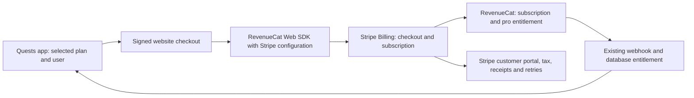

# Stripe Billing through RevenueCat: migration assessment

Date: 2026-09-21. Status: future migration deferred by Elliott; retain RevenueCat Billing for Build 15. Owner: Elliott. Live tax preparation is tracked in [Build 15 tax readiness](BUILD15-TAX-READINESS.md). This assessment grants no release, charge, or refund authority.

Companion: [Build 15 payment package](BUILD15-PAYMENTS.md). Website source inspected at `18a3107`; app source in `Quests-worktrees/build15-payment-routing-20260921`. Existing app paywall work belongs to the Build 15 lane and was preserved.

## Recommendation

Launch recommendation after the September 21 finance review: retain RevenueCat Billing, complete tax collection and financial reconciliation on that path, and qualify Stripe Billing separately for Link and Cash App Pay. The provider supports those methods alongside cards, Apple Pay, and Google Pay. Keep the current release's billing implementation until the new path passes its own acceptance gates. A last-minute switch introduces subscription-lifecycle and tax configuration work beyond adding payment buttons.

The confirmed incremental Billing charge is 0.7% of Billing volume. At the current prices, the fee-only difference is about $0.035 per monthly payment or $0.210 per annual payment before taxes and any change in tax-service charges. The larger near-term issue is existing tax readiness. The initial audit found live New York collection and RevenueCat automatic tax disabled. After Elliott authorized activation, the live registration was added and RevenueCat tax enabled on September 21. Rendered tax, lifecycle and financial reconciliation acceptance remain open; see the readiness record.

Website changes are required. Native-client changes are conditional on browser and return-flow qualification. The existing entitlement schema already accepts `STRIPE`, so this review found no inherent need for a new subscription table or store-enum migration. Backend compatibility and deployment still require proof.

## Scope and preserved behavior

- Standard Stripe Billing, with Nothing Serious LLC retaining seller and merchant-of-record responsibilities. Stripe Managed Payments remains outside this proposal.
- Existing authenticated Supabase UUID remains the RevenueCat app user ID and entitlement owner. A Link contact email is independent of Quests phone authentication; the signed UUID determines ownership.
- Monthly $4.99 and annual $29.99 USD plans, no trial, and the existing `pro` entitlement remain the intended catalogue.
- The selected plan continues directly to checkout. Quests supplies no email prefill. Stripe or the wallet can collect required contact and billing information.
- Preserve the Build 15 USA iOS eligibility rule, native Apple fallback, Android Google Play routing, signed capabilities, environment binding, duplicate-purchase protection, and emergency web-off control.
- PayPal remains unsupported in RevenueCat's Stripe purchase flow. Bank debit/transfer methods that settle asynchronously are also unsupported. Cash App Pay requires eligible US businesses and customers and USD. Actual account eligibility and button presentation remain to be demonstrated. [RevenueCat Stripe integration](https://www.revenuecat.com/docs/web/integrations/stripe), [Stripe Cash App Pay](https://docs.stripe.com/payments/cash-app-pay).

## Evidence and current gaps

Account evidence below records the initial signed-in Chrome audit on September 21, before the later authorized tax changes. The readiness record contains the subsequent configuration evidence.

| Item | Verified evidence | Implication |
|---|---|---|
| Stripe Payments plan | Standard, 2.9% + 30 cents for domestic cards | Use this account rate for the base model |
| Stripe Billing plan | Pay as you go, 0.7% of Billing volume | Additional subscription-management cost when Stripe owns billing |
| Stripe Tax plan | Tax Basic: 0.5% no-code transaction or $0.50 API transaction; 10 calculation calls included per API transaction, then $0.05 each | Confirm which meter each RevenueCat integration uses |
| Stripe Tax activity | Current period shows zero no-code transactions, API transactions, and calculations | No existing tax usage charge establishes the applicable integration meter |
| Live tax locations | New York: Not collecting tax; Collecting and filing: 0 | Live tax readiness is incomplete |
| Existing RC Web Billing | Automatic tax unchecked; address collection only when required | Tax collection needs deliberate qualification under either provider |
| RC account | Quests project owned by current account, Pro plan; period Aug 27 to Sep 27 shows $0 tracked; no payment method set | Current RC charge is under free threshold; ensure billing readiness before reaching it |
| Wallet domain | Earlier browser verification in this investigation found `invite.thequestsapp.com` enabled in both test and live mode; review pages.dev domain absent | Production domain registration gap in earlier notes is resolved; staging domain still needs registration in its actual test account |
| Existing paid subscriptions | A full subscription inventory was not completed | $0 current-period MTR does not establish zero historical subscribers |

Read-only account pages: [Stripe plans](https://dashboard.stripe.com/acct_1Rsp23Ic0E6TglSd/settings/plans-and-fees/plans), [Stripe Tax locations](https://dashboard.stripe.com/acct_1Rsp23Ic0E6TglSd/tax/locations), [RevenueCat web configuration](https://app.revenuecat.com/projects/22287094/web/app20b28546eb?activeTab=payment-provider), [RevenueCat billing](https://app.revenuecat.com/settings/billing).

**Certificate update, September 21:** Elliott confirms that Nothing Serious LLC has received the New York Certificate of Authority. This supersedes the pending-certificate status in the older wiki runbook/calendar. Receipt is confirmed by Elliott; the effective/start date, assigned filing frequency and first deadline require state-account evidence. Stripe live registration and RevenueCat tax were subsequently enabled; actual checkout collection remains to be tested.

Elliott subsequently confirmed that the certificate does not state the requested date or filing frequency. Verify those details through New York Tax Online Services, the filed DTF-17, or approval correspondence. Most new vendors file quarterly, but the actual account obligations control the calendar. New York makes the applicable return available through Web File, and zero activity can still require a return. These missing calendar details do not prevent staging tax configuration. [New York filing requirements](https://www.tax.ny.gov/pubs_and_bulls/tg_bulletins/st/filing_requirements_for_sales_and_use_tax_returns.htm), read September 21.

## Economics

### Base fees

| Cost | Current RC Billing | Proposed Stripe Billing through RC |
|---|---|---|
| Domestic card processing | 2.9% + $0.30 | 2.9% + $0.30 |
| Link card processing | Unavailable in current RC flow | Published 2.9% + $0.30 |
| Cash App Pay processing | Unavailable in current RC flow | Published 2.9% + $0.30 |
| Subscription billing engine | Included with RC plan | Stripe Billing: 0.7% of Billing volume |
| RevenueCat | Pro free below threshold, then 1% of monthly tracked revenue | Same RC plan remains applicable |
| Tax calculation | Tax provider charge if enabled | Stripe Tax charge if enabled |
| Tax filing and registration | Separate operating responsibility and costs | Same responsibility; Tax Basic covers calculations |

Sources: [Stripe pricing](https://stripe.com/pricing), [Cash App Pay pricing](https://stripe.com/pricing/local-payment-methods#cash-app-pay), [Billing pricing](https://stripe.com/billing/pricing), [RevenueCat pricing](https://www.revenuecat.com/pricing/), [Stripe Tax pricing](https://stripe.com/tax/pricing). Accessed September 21.

RC's pricing FAQ states that reaching $2,500 MTR produces a $25 charge. Model the 1% on the full tracked amount for qualifying months. This is an account-level threshold across tracked activity; this document does not assign a separate free allowance to web sales. Current RC dashboard confirms Pro and zero current-period tracked revenue.

### Per-payment illustration

USD, domestic card or proposed Link card/Cash App Pay, no customer tax, no discount, no refund, no FX, no tax-service fee, no tax on vendor fees. Amounts use unrounded arithmetic and are displayed to cents. Actual provider billing can round separately. These are payment proceeds after the listed fees, before infrastructure, support, acquisition, and income taxes.

| Per successful charge | Monthly $4.99 | Annual $29.99 |
|---|---:|---:|
| Processing fee, both paths | $0.44 | $1.17 |
| Added Stripe Billing fee | $0.035 | $0.210 |
| Current proceeds while RC is free | $4.55 | $28.82 |
| Proposed proceeds while RC is free | $4.51 | $28.61 |
| Current proceeds at RC 1% | $4.50 | $28.52 |
| Proposed proceeds at RC 1% | $4.46 | $28.31 |

Formula: current = price - (0.029 x price + 0.30) - RC allocation. Proposed = current - 0.007 x price. At $10,000 monthly Billing volume, the extra Billing charge is $70 before other differences.

With RC at 1%, constant plan mix and unchanged tax/retention/refund behavior, approximately 0.78% more monthly-plan payments or 0.74% more annual-plan payments offsets only the added Billing fee. These are relative increases calculated as current proceeds / proposed proceeds - 1. They are break-even illustrations; no conversion uplift has been measured. Development time and new operational risk remain outside that calculation.

### Tax costs can change the comparison

The account's Tax Basic plan distinguishes 0.5% for Billing/Checkout integrations from $0.50 per API tax transaction. RevenueCat Billing's public tax page describes a per-transaction Stripe Tax fee without identifying the applicable meter. The currently disabled integration has no tax usage in the inspected account period. **Confirm the RC Billing meter and proposed Stripe Billing meter before treating the tax-cost comparison as settled.** [RevenueCat tax documentation](https://www.revenuecat.com/docs/web/web-billing/tax).

At a $4.99 illustrative fee base, 0.5% is about $0.025 versus $0.50; at $29.99 it is about $0.150 versus $0.50. Stripe confirms the percentage Tax fee includes customer sales tax in its transaction base, so taxable sales have a slightly larger calculation fee. Verify the Billing fee base separately. If the current compliant path uses the API meter and the proposed path uses the percentage meter, tax-service savings could offset the 0.7% Billing charge. If both use the same tax pricing, the 0.7% remains incremental. Comparing the proposed tax-enabled path to today's tax-disabled configuration would mix the migration cost with the existing tax-readiness work. [Stripe Tax fee calculation](https://support.stripe.com/questions/understanding-stripe-tax-pricing).

Stripe also charges sales tax on certain SaaS service fees, including Billing and Tax, where applicable to the business location. Inspect the first fee invoice for the actual treatment. This is a business expense separate from customer tax held for remittance. [Stripe US taxes on fees](https://support.stripe.com/questions/taxes-on-stripe-fees-and-products-for-businesses-based-in-the-united-states).

Other sensitivities:

- Standard card processing fees are retained on refunds. Standard published dispute costs can exceed one $4.99 payment. Test refunds and budget fraud/support separately. [Stripe pricing](https://stripe.com/pricing).
- The 30-cent fixed fee is proportionally expensive at $4.99 and applies to each successful renewal. Annual-plan fee efficiency already exists under both systems.
- Link funding methods have different pricing and integration support. The base model uses Link cards. Do not apply a cheaper bank-funded Link rate without proving that funding path works with RevenueCat recurring purchases.
- International cards, currency conversion, optional portal domains, paid add-ons, filing services, and implementation effort are excluded. US storefront eligibility alone does not establish card origin or customer tax location.
- Retain normal prices and avoid adding trials, coupons, BNPL, or proration changes to this migration. They would enlarge the economics and testing scope.

Financial context reviewed: wiki Financial Baseline and Funding, Financial Operations, and the local canonical workbook's Summary, Funding, Budget, Sources, and Review items tabs. RevenueCat is marked Verify/unpriced in Budget row 52; sales-tax administration is a separate $125 monthly planning allowance in row 62. These are planning records, not verified invoices. The workbook and operating budget were unchanged. No burn, cash-runway, or historical profit conclusion is made here.

## Tax and accounting implications

**Standard Stripe Billing preserves Nothing Serious LLC's seller responsibilities.** Using Link or Cash App Pay does not by itself change the product sold or customer jurisdiction. Sales-tax registration, collection, filing, and remittance remain company responsibilities. The integration choice does not by itself change the LLC's income-tax classification. A tax professional should confirm the product classification, registrations, and bookkeeping treatment against the company's facts.

New York's current guidance taxes prewritten software delivered by remote access and sources remote software sales to the user's location. The wiki applies this to Quests Pro. The same tax-readiness gate therefore applies to the current and proposed web paths. [NY computer software guidance](https://www.tax.ny.gov/pubs_and_bulls/tg_bulletins/st/computer_software.htm), [NY vendor registration](https://www.tax.ny.gov/bus/st/register.htm).

Required evidence before taxable production web sales:

1. Certificate of Authority received, confirmed by Elliott on September 21. Verify its effective/start date, filing cadence, and first return date from the approval record. Keep sensitive registration details in the private vault.
2. Required registrations active in live Stripe Tax and separately configured in the test environment. A Stripe tax setting does not establish government registration.
3. Approved product tax code on the new Stripe products, intended tax-exclusive USD price behavior, and automatic tax enabled for the actual checkout and renewal subscription. RC Billing's product tax configuration does not automatically establish Stripe product settings.
4. Customer location collected sufficiently for calculation, including wallet addresses, changed addresses, and missing/invalid postal data. Email prefill remains absent. Document any additional address step introduced by tax collection.
5. Taxable and exempt-location examples verified against an expected result, with checkout total, receipt, Stripe tax transaction, and refund tax reversal evidence.
6. Filing owner, tax reserve, tax report reconciliation, and return deadlines recorded. Tax Basic's calculation plan is separate from a filing/remittance service.

The current signed capability checks USA storefront; the inspected routing/website path did not demonstrate a state-specific New York purchase block. Preserve the global web-off control until the applicable tax gate is resolved or a separately verified restriction exists. A postal restriction would itself require additional implementation and bypass tests.

RevenueCat's new Stripe configurations default to tax-excluded revenue reporting. That reporting switch does not enable customer tax collection. Keep gross subscription sales, collected tax, processor/Billing/Tax fees, refunds, and net payouts separate in accounting. Reconcile RC metrics to Stripe; use one financial import owner to avoid posting the same sale twice. [RevenueCat tax reporting behavior](https://www.revenuecat.com/docs/web/integrations/stripe#tax-behavior).

## Implementation impact

| Surface | Expected work | Assessment |
|---|---|---|
| Stripe and RC configuration | Add a Stripe Billing web configuration; create/import monthly and annual Stripe prices; attach both to `pro`; configure eligible methods, tax, retries, emails, and customer portal | Required |
| Website `functions/subscribe.js` | Replace environment-specific provider key and product mapping; keep signed plan and deployment-bound environment checks | Required |
| Website `subscribe-app.js` | Qualify SDK/provider compatibility, product selection, purchase options, cancellation semantics, return behavior, and loading/errors | Required review and likely edits; current SDK pin is 1.42.1, compatible minimum remains unverified |
| Checkout appearance and `_headers` | Rework RC-specific `.rcb-*` styles/DOM observers as necessary; verify Stripe form styling and CSP, iframe, auth, and wallet navigation needs | Required visual/security qualification |
| Native `UpgradeProLink.tsx` | Existing URL contract and selected plan can remain. Test the actual `openBrowserAsync` sheet with Link authentication and Cash App transitions | No mandatory native code change identified; failed return/browser tests would create one |
| Subscription management | Existing `subscriptionManagementService.ts` accepts HTTPS management URLs. Configure and verify Stripe Customer Portal URL, cancellation, payment update, receipts | Configuration required; client edits conditional |
| Backend signer | Existing RC project subscription lookup is provider-agnostic. Verify incomplete/past-due/cancelled Stripe subscriptions and delayed RC updates against purchase-attempt rules | Required integration tests; changes conditional |
| RC webhook and reconciliation | Existing RPC receives dynamic store/product IDs. Verify Stripe event identities, lifecycle, replay, ordering, grace, expiration, refund and entitlement refresh | Required integration tests; source compatibility alone is insufficient |
| Database | Existing entitlement store CHECK includes `STRIPE` and `RC_BILLING`; purchase attempts track `web`/`native` rather than billing provider | No new schema requirement identified; inspect deployed migrations before deciding |
| Deployment | Existing Build 15 functions/migration and production sandbox exclusion have separate outstanding deployment gates | Keep those gates even if this migration adds no SQL |

Source pointers in the app repository: `src/components/UpgradeProLink.tsx`, `src/services/subscriptionManagementService.ts`, `supabase/functions/sign-upgrade-link/handler.ts`, `supabase/functions/sign-upgrade-link/policy.ts`, `supabase/functions/revenuecat-webhook/index.ts`, `supabase/functions/revenuecat-webhook/sandboxPolicy.ts`, and `supabase/migrations/20260507135000_v2_canonical_baseline.sql` (store CHECK at line 20044).

Important lifecycle constraints:

- Stripe owns subscription retries, customer emails, and its portal. RC documents cancellation propagation of up to two hours and emits a billing-issue event once rather than on every failed retry.
- RC warns that Stripe Test Clocks are not fully supported and can produce inaccurate cross-system data. Test-clock results are supplementary evidence.
- Current checkout releases an attempt only on explicit SDK cancellation. Browser close, timeout, or uncertain provider outcome leaves it pending. Verify the Stripe-backed SDK cancellation cannot release a still-payable session. Any provider-side session persistence mismatch needs a correction before launch.
- Preserve the known UUID through Stripe, RC, and the webhook. Browser redirects and wallet email addresses confer no entitlement.
- Source production sandbox protection rejects web `STRIPE` sandbox events. Prove its deployment before any production-connected sandbox exercise. New RC app configuration/webhook filters must also match their intended environments.

Provider constraints: [RevenueCat Stripe compatibility and setup](https://www.revenuecat.com/docs/web/integrations/stripe).

## Qualification and release gates

All rows below are **planned, unexecuted** for the proposed Stripe Billing path. Existing RC Billing tests do not count as migration acceptance. Record commit, deployment, app build, environment, domain, provider mode, synthetic user, event IDs, expected/actual result, evidence location, and reviewer for every case. Preserve PII and full receipts privately.

| ID | Test | Required evidence |
|---|---|---|
| SB-01 | Monthly/annual catalogue and identity | Exactly $4.99/$29.99, no trial, correct period, same UUID and `pro`; checkout email different from app identity stays on correct account |
| SB-02 | Signed-link security | Tampered plan/UID/env/scheme, expired signature, unauthenticated and replay attempts fail closed |
| SB-03 | Staging simulator journey | Native plan selection -> staging domain -> sandbox payment -> return -> webhook -> database -> visible Pro; cold restart preserves access |
| SB-04 | Production-connected simulator journey | Correct production app identity, backend and domain; web-off behavior, native fallback, duplicate protection, return and entitlement refresh verified with designated account |
| SB-05 | Environment isolation | Staging cannot select live credentials; production cannot consume web sandbox entitlement; no cross-project user write or unlock |
| SB-06 | Card baseline | Both plans, success, decline, authentication challenge, retry, cancel and abandonment on deployed HTTPS checkout |
| SB-07 | Apple Pay and Google Pay | Eligible physical devices/browsers show the method; complete authorized test purchase and return; unavailable wallet leaves usable alternatives |
| SB-08 | Link | New and returning Link customer, verification challenge, different email, success, cancel, expired auth, mobile sheet and desktop; exact method funding captured |
| SB-09 | Cash App Pay | US/USD eligibility, mobile app handoff and return, installed/missing app behavior, desktop QR, auth cancellation and timeout; no duplicate charge |
| SB-10 | Tax and location | Taxable and exempt examples, wallet address, changed location, missing address, tax-exclusive total, correct tax transaction and receipt |
| SB-11 | Multi-device duplicate protection | Rapid taps, concurrent links, existing native subscriber, existing RC Billing subscriber and new Stripe subscriber; at most one payable purchase path |
| SB-12 | Delayed and uncertain payment | Payment succeeds before webhook; browser/network closes; app kill/reopen; pending state avoids second charge and eventually resolves from provider evidence |
| SB-13 | Event integrity | Duplicate, stale, out-of-order and invalid-auth webhook events; valid replay is idempotent, forged return grants nothing |
| SB-14 | Renewal and recovery | Renewal, failed renewal, retries, grace, recovered payment and final expiration synchronize through Stripe -> RC -> database -> app |
| SB-15 | Cancellation and refunds | Period-end cancellation preserves access until expiry; immediate cancellation/full/partial refund behavior matches chosen policy; tax reversal reconciles |
| SB-16 | Customer portal | User can update method, cancel and retrieve receipts; portal access and management URL work after re-login on both app platforms |
| SB-17 | Native regressions | Apple purchase/restore, Google purchase/restore, web-off fallback and existing subscribers remain correct |
| SB-18 | Money and accounting | Controlled live payment and approved refund: gross, tax, processing, Billing, Tax fee, RC attribution, settlement and accounting import reconcile; verify actual tax meter |
| SB-19 | Rollback | Stop new web starts while preserving existing subscribers' renewals, portal access, event processing, refunds and entitlement reads |
| SB-20 | Checkout usability | Phone sizes, keyboard, loading, back/close, offline, accessibility, required legal copy and CSP; selected plan preserved and no Quests email prefill |

Staging simulators exercise native integration and sandbox payment behavior. Production-connected simulators exercise the production app/backend contract under its permitted routing. Neither establishes physical wallet authentication, installed Cash App handoff, or live settlement. Complete those with a physical iPhone and eligible Android/browser coverage as applicable. Do not enable web sandbox grants in production to simplify tests.

Full monthly/annual renewal timing cannot be compressed faithfully through the unsupported RC/Stripe test-clock combination. Use provider-supported lifecycle fixtures plus real-time sandbox evidence, document remaining timing limits, and schedule observation of first live renewals. Production failure injection and live charges/refunds require a separately agreed account, amount, and execution window.

### Sequence

1. Resolve tax certificate/registration evidence, approved product treatment, actual tax meters, eligible payment methods, and existing subscriber inventory.
2. Implement a separate branch and isolated Stripe sandbox/RC configuration using the current signed contract. Preserve native offerings while adding web products.
3. Complete source checks, deployed staging checkout, staging simulator journey, physical wallet/app handoffs, lifecycle tests and rollback rehearsal.
4. Review exact website/backend diff and determine whether a native binary change is needed. Record Elliott's acceptance before integration and deployment.
5. Deploy required backend isolation and new checkout with public web routing disabled. Verify production-connected simulator controls and read-only provider configuration.
6. Run a narrowly scoped production pilot with designated users, real device evidence, and specifically authorized payments/refunds. A per-user rollout mechanism has not been verified in current source; implement and test one if the pilot needs it. Never approximate a private pilot by briefly enabling web globally.
7. Activate broader web routing only after pilot acceptance and financial reconciliation. Observe errors, duplicate attempts, conversion, payment-method mix, tax, refunds, and first live renewals.

Rollback closes new checkout attempts and retains both providers' subscription/event handling. If any RC Billing subscribers exist, retain their billing and management path until a separate subscriber-migration plan is approved. Changing the new-checkout provider does not move existing subscriptions automatically.

## Open decisions and exit criteria

| Question | Evidence needed before rollout |
|---|---|
| Certificate received; which dates and filing cadence apply? | Elliott confirms receipt September 21. Read effective/start date, assigned filing cadence and first deadline from approval; Stripe live NY collection is now activated; government effective date and filing cadence remain open |
| What tax fee does each path incur? | Provider confirmation or attributable fee/usage evidence, including fee base and taxes on provider fees |
| Is Cash App Pay enabled and eligible for this account? | Live account method status plus recurring test completion |
| Does SDK 1.42.1 support the selected Stripe configuration? | Official version evidence and deployed purchase test; pin a compatible version if needed |
| Can a cancelled checkout still complete externally? | Stripe session/subscription and RC evidence after every cancel/close branch |
| Are existing paid subscribers present? | Inventory by provider, status, customer identity and management path |
| Which backend pieces are actually deployed? | Staging and production migration/function receipts, webhook filters and rejection evidence |
| Is the release window sufficient? | All critical cases complete, named remaining observations, rollback proved, Elliott acceptance |

Initial research checkpoint: investigation and documentation only. Subsequent decision: retain RevenueCat Billing for Build 15 and defer this migration. The later authorized tax configuration changes are recorded separately in the readiness document. Application code, SQL, deployments, purchases, refunds and simulator sessions remain unchanged by this investigation.

## Billing address and customer tax location

Quests profiles do not need an address field for the current integration. RevenueCat's checkout collects billing information and passes location to its tax provider. Card checkout uses the customer-entered billing address; the country initially comes from IP geolocation. Apple Pay and Google Pay use the wallet payment method's billing address. Email, Apple storefront and the issuing bank's country do not establish the customer's precise tax location. [RevenueCat tax location and wallets](https://www.revenuecat.com/docs/web/web-billing/tax).

For Build 15, Only when required is now selected and saved as Elliott's primary default. It supersedes the earlier Always setting. RevenueCat still requests the location details required for tax calculation. Wallets retain their own address flow; RevenueCat says the address-collection setting does not affect wallets or express checkout. Browser autocomplete can reduce typing. Saved details must remain reviewable, especially after a move.

Stripe recommends a full US address for local-tax accuracy. It supports country plus ZIP, but uses the geographic center of the first five ZIP digits when full-address resolution is unavailable. IP location is less precise and unsuitable as the sole basis for US local taxes. Even a supplied street address can fall back to ZIP when it cannot be matched. The selected lower-friction default requires checkout and tax-record tests to establish the actual location precision. [Stripe customer locations](https://docs.stripe.com/tax/customer-locations), read September 21.

The configured personal-use SaaS code is `txcd_10103000`. The RevenueCat selector identifies `txcd_10103001` as business-use SaaS, correcting the earlier wiki-derived label. RevenueCat uses its own selected code and ignores Stripe's default product code. The live Stripe registration wizard currently previews its separate default, General - Electronically Supplied Services, at 0% in New York; that preview is insufficient evidence for the configured RevenueCat purchase.

Required tests include NYC and another NY jurisdiction, an unregistered/non-taxable location with a supported zero-tax reason, missing/invalid address, conflicting country/state/ZIP, IP-country mismatch, a changed billing address, wallet address edits, and renewal after a move. Capture the tax jurisdiction and amount in private provider evidence. A missing location must produce a recoverable checkout error or an explicitly investigated provider result. Do not silently treat it as exempt. No new client address form or Quests database migration is required for this configuration.

## Checkout pricing recommendation

Show the subscription price, actual sales tax calculated from the customer's location, and total due before confirmation. Keep payment-processing costs within the advertised subscription price. Preserve the selected plan and absence of Quests-supplied email prefill.

Example for an illustrative 8.875% taxable location, subject to the actual provider calculation:

| Checkout line | Monthly | Annual |
|---|---:|---:|
| Quests Pro subscription | $4.99 | $29.99 |
| Sales tax | $0.44 | $2.66 |
| Total due | $5.43 | $32.65 |

The existing RevenueCat Billing checkout already supports tax breakdowns, receipts, and customer-portal tax details. Its documented US/Canada behavior adds tax to the product price. Enable and qualify the provider's actual tax calculation. A custom visual line cannot establish a collected tax amount or tax record. [RevenueCat tax display and configuration](https://www.revenuecat.com/docs/web/web-billing/tax), accessed September 21.

Avoid a combined customer-facing "tax and processing" amount. Sales tax is calculated under jurisdiction rules and held for remittance; processing is a merchant expense. A higher commercial price can cover operating costs, but the actual tax must still be determined and recorded separately. Any price increase should be visible on the plan offer and in recurring-billing terms before checkout and separately approved.

Separate processing surcharges create additional work and restrictions:

- New York requires disclosure of the full credit-card price before sale and limits the surcharge to the business's card cost. Its examples reject adding a surprise processing, technology, or service fee for card users. [New York official guidance](https://www.governor.ny.gov/news/governor-hochul-announces-new-law-clarify-disclosure-credit-card-surcharges-goes-effect-sunday).
- Visa requires 30 days' notice to the acquirer, permits surcharging only on credit transactions, excludes debit/prepaid cards, and limits the surcharge to acceptance cost with a 3% maximum. Wallet payments can use debit or prepaid cards, so wallet branding cannot determine surcharge eligibility. [Visa merchant requirements](https://usa.visa.com/content/dam/VCOM/global/support-legal/documents/merchant-surcharging-considerations-and-requirements.pdf), [Visa merchant rules](https://usa.visa.com/support/small-business/regulations-fees.html). Read in Chrome September 21.
- At $4.99, 2.9% + $0.30 is about $0.445, or 8.91%. A Visa surcharge capped at 3% would recover at most about $0.150 on that illustrative amount. It cannot simply recover all Stripe, RevenueCat, Billing, and Tax costs.
- A universal mandatory service charge is a separate pricing design with its own disclosures and tax treatment. Renaming a card-specific fee does not resolve its restrictions. Nationwide sales and other card/payment methods require their own review.
- Current source selects one RevenueCat package per purchase. A dynamic extra fee is additional provider/UI/recurring-invoice scope. It also requires eligibility, renewal, tax, refund and wallet tests.

For launch, retain $4.99/$29.99 plus applicable sales tax and measure contribution after actual fees. Revisit the advertised price after measured conversion, retention and fee data. A universal surcharge is outside the recommended launch scope.

## Finance automation integration review

Reviewed September 21: wiki `financial-operations.md`, `finance-automation-controls.md`; private `AUTOMATION-RUNBOOK.md`, `latest-run.json`, `daily-runs/2026-09-20.json`, `operations-model.mjs`, `build-report.mjs`, and `refresh.py`. No pipeline, financial records, or ledger entries were modified.

### What exists and what is proven

- Intended architecture: Stripe transaction evidence feeds QuickBooks accounting, Mercury/bank activity proves settlement, RevenueCat supplies entitlement and subscription comparisons, and the existing private Excel/Drive workbook supplies reporting and cash planning.
- The local model validates live mode, company name, USD integer amounts, complete pagination, stable transaction IDs, and gross minus fee equals net. It classifies payouts/transfers as cash movements and preserves original dates.
- The reporting pipeline has archive hashes, concurrent-run protection, preserved last-good outputs, desktop Excel/Drive conflict checks, and separate local-build versus hosted-publication status.
- Latest saved successful full report/publication is September 14. The September 20 run records failed live-source refresh, retains September 15 as the last complete daily run, and leaves receipt archive byte-readback pending. No September 21 daily-run record was present during this review.
- The September 14 record says the official Stripe Connector by QuickBooks is installed with auto-add off. Current Chrome access reaches the QuickBooks sign-in screen. Today's mapping and sync status therefore remain unverified. A signed-in browser session would allow inspection; it would not by itself prove unattended refresh reliability.

This is an implemented reporting foundation with incomplete operating proof. It should be extended for taxable subscriptions before representing the process as fully automated end-to-end billing and accounting.

### Concrete gaps found in source

1. **Customer tax split:** `operations-model.mjs:39` labels the full Stripe charge/payment amount as "Gross sale". `build-report.mjs:178` totals that charge amount under gross sales. There is no separate sales-tax liability field in the settlement register. This is an observed reporting limitation; this review found no evidence of a tax-inclusive sale being incorrectly posted to QuickBooks.
2. **Provider detail:** balance transactions establish cash and fees but do not alone establish subscription subtotal, discount, tax jurisdiction, service period, or tax-refund allocation. Join the relevant RC Billing invoice/receipt and Stripe Tax records for the existing path; use Stripe invoice/subscription/tax records for the proposed path. RC Billing does not use Stripe Billing invoices as its subscription authority.
3. **Separate fees:** standalone fee adjustments remain "Review required". Billing/Tax charges, vendor sales tax, disputes and RC's separate invoice need defined mappings so fee totals include their complete sources.
4. **Independent source freshness:** `refresh.py` checks the main live-report timestamp. The inspected Stripe model preserves/displays its own `checked_at` without independently enforcing its age. Enforce freshness and coverage on each input, especially Stripe and tax data, before a report can be labelled current.
5. **Operating acceptance:** complete purchase-to-tax-to-ledger-to-bank reconciliation, scheduled report replacement, tax-return reconciliation, and first paid-subscription lifecycle remain open. Prior receipt-matching tests do not establish these paths.

### Recommended extension

Keep the current financial systems and add one reconciliation record per financial event:

`provider + live/test + payment/invoice ID + refund/event ID -> subtotal/discount + sales tax + customer total -> processing/Billing/Tax fees -> processor balance -> payout -> bank match -> QuickBooks posting reference`

Use the existing Stripe connector as the candidate accounting import owner. First inspect its mapping and treatment of tax, refunds and fees in QuickBooks. Keep auto-add off until a reviewed taxable sale and refund reconcile. The reporting pipeline enriches and checks that import; it must avoid independently posting the same sale. RevenueCat events continue to grant/revoke Pro and support comparisons.

Minimum reporting fields: plan and billing period, source payment/invoice IDs, pretax billed amount, discount, actual sales tax, tax jurisdiction, refund and tax reversal, processor net, separate provider charges, payout/bank match, QuickBooks ID and review state. Annual cash collection and earned-revenue policy remain separate; establish the recognition policy with the bookkeeper/CPA.

Treat collected customer tax as a liability and exclude it from spendable operating cash. Reconcile Stripe Tax totals and adjustments to the tax-liability ledger, assigned return period, filed return and payment evidence. Keep registration/filing reminders tied to the certificate's actual dates. The existing Tax Basic plan calculates tax; an automated filing service or a named filing owner is a separate decision. Tax reserve transfers and filings retain their own execution authority.

Required finance tests: taxable sale, zero-tax sale with supported reason, full/partial refund with correct tax reversal, retained processing fee, standalone service fee, dispute, duplicate import, payout/bank match, stale input rejection, missing invoice/tax evidence, and zero-tax-return period. Preserve receipt/invoice evidence in the private vault and surface only exceptions in the daily report.

## Honest assessment of an afternoon implementation

These are engineering judgment estimates, not delivery commitments. They assume certificate details are available, Elliott can restore account access, provider permissions work, and an available physical device can complete the checkout. Existing Build 15 deployment and acceptance gates remain separate dependencies.

| Scope | Difficulty | Realistic afternoon outcome |
|---|---|---|
| Existing RC Billing tax configuration | Low to moderate implementation; meaningful verification | Plausible target: prepare/configure test and live registrations correctly, verify tax code and collection, deployed test checkout, receipt/tax breakdown and device return. Roughly 2 to 4 focused hours after prerequisites; any deployment/access issue can extend this |
| Finance integration assessment and mapping | Moderate | Already researched here. A scoped implementation and local fixtures may fit a further 2 to 4 hours; connector mapping, authentic evidence and hosted publication need their own checks |
| Stripe Billing + Link/Cash App staging prototype | Moderate implementation | A working staging demonstration may be possible in several focused hours if SDK/configuration support works as documented |
| Fully qualified Stripe Billing production migration | High release-validation burden | Do not commit to completing the entire qualification and financial acceptance this afternoon. Device handoff, cancellation persistence, delayed RC updates, tax, existing subscribers and rollback remain material |
| Customer processing surcharge | High relative to benefit near launch | Exclude from this afternoon's release scope; network notice, pricing design and method-specific restrictions require additional work |
| Fully proven automated financial close | Multi-cycle operating proof | Requires fresh authenticated sources, transaction/settlement evidence, scheduled-run success and review. Settlement and recurring lifecycle timing extend beyond a same-afternoon coding session |

Recommended priority for the afternoon: (1) certificate dates and tax settings, (2) tax-enabled existing checkout on a deployed test domain and physical phone, (3) targeted finance tax/fee mapping and fixture tests, (4) controlled live validation only after its separate approval. Keep Link/Cash App development as a follow-up lane. If the current checkout fails these tax or lifecycle gates, retain the web-off control and existing native purchase route while resolving them.

Elliott's help is most valuable for certificate dates, QuickBooks and provider sign-in/permissions, physical-wallet authentication, and deciding the budget/account for an eventual real payment/refund pilot. Those actions cannot replace renewal, settlement, and scheduled-run evidence.
